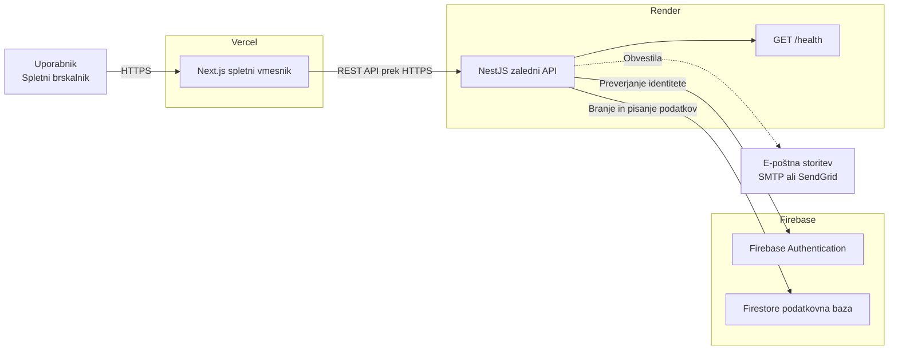
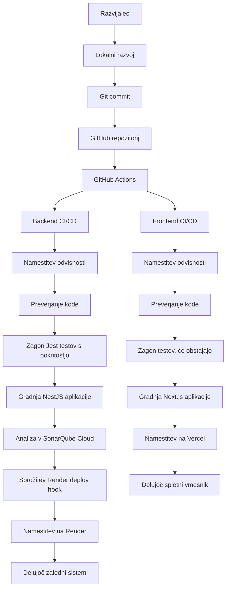
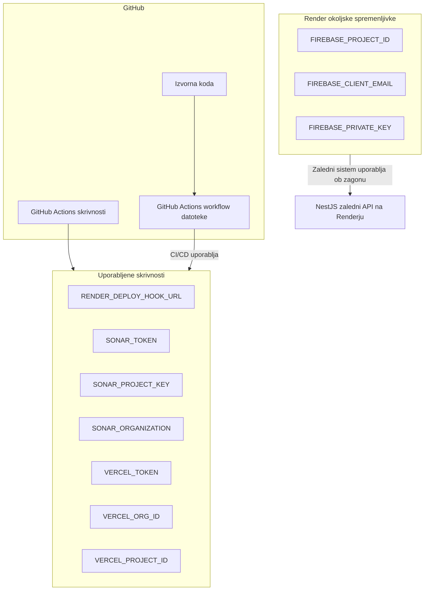

# Diagrami Namestitve

Ta dokument prikazuje arhitekturo namestitve sistema Confera in tok CI/CD procesa. Diagrami so zapisani v Mermaid sintaksi, zato se lahko prikažejo neposredno v GitHubu in se kasneje izvozijo kot PDF diagrami.

## Arhitektura Namestitve Sistema

## CI/CD Tok Namestitve

## Okolja In Zunanje Storitve

