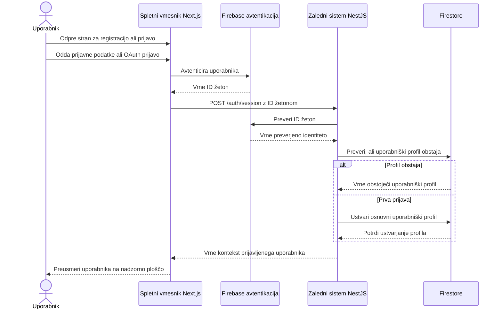
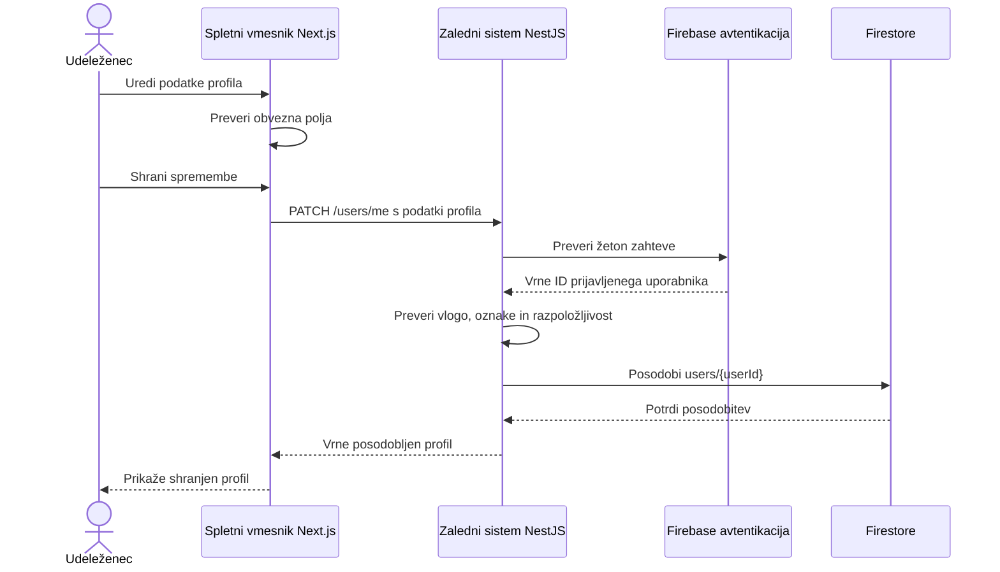
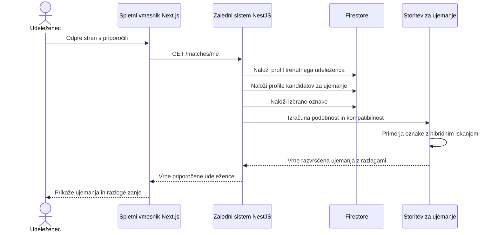
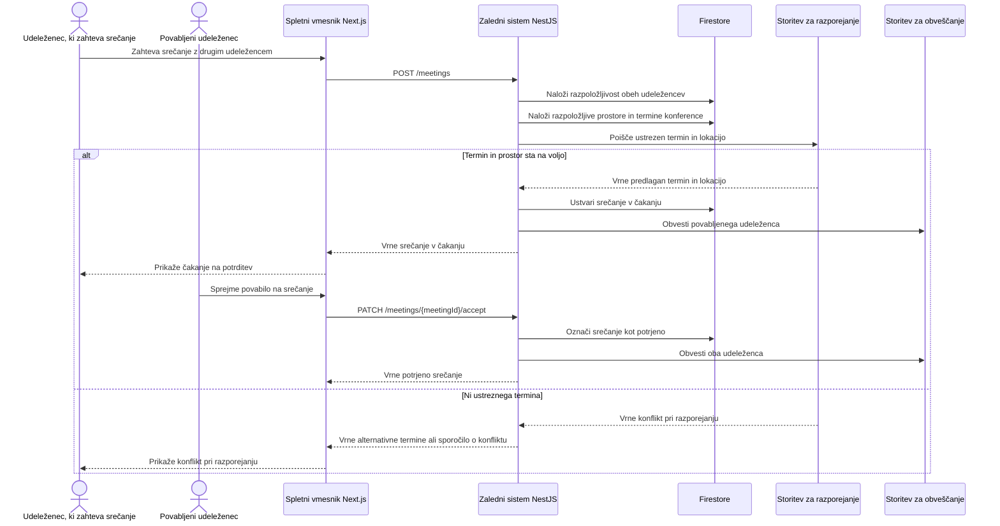
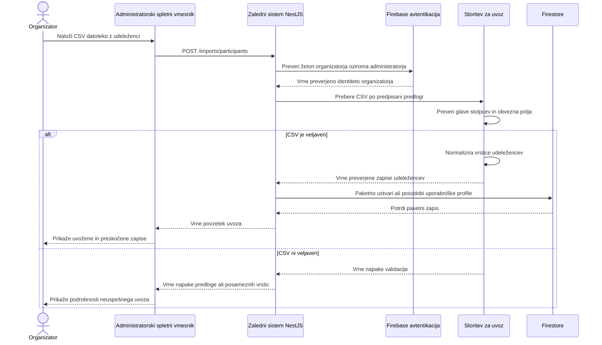

# Sekvenčni Diagrami

Ta dokument vsebuje glavne tokove interakcij med uporabnikom, spletnim vmesnikom, zalednim sistemom in zunanjimi storitvami sistema Confera. Diagrami so zapisani v Mermaid sintaksi, zato se lahko prikažejo neposredno v GitHubu in se kasneje po potrebi izvozijo kot PDF diagrami.

## Registracija in prijava uporabnika

## Posodobitev profila udeleženca

## Zahteva za AI ujemanje

## Razporejanje srečanja

## Uvoz udeležencev iz CSV

