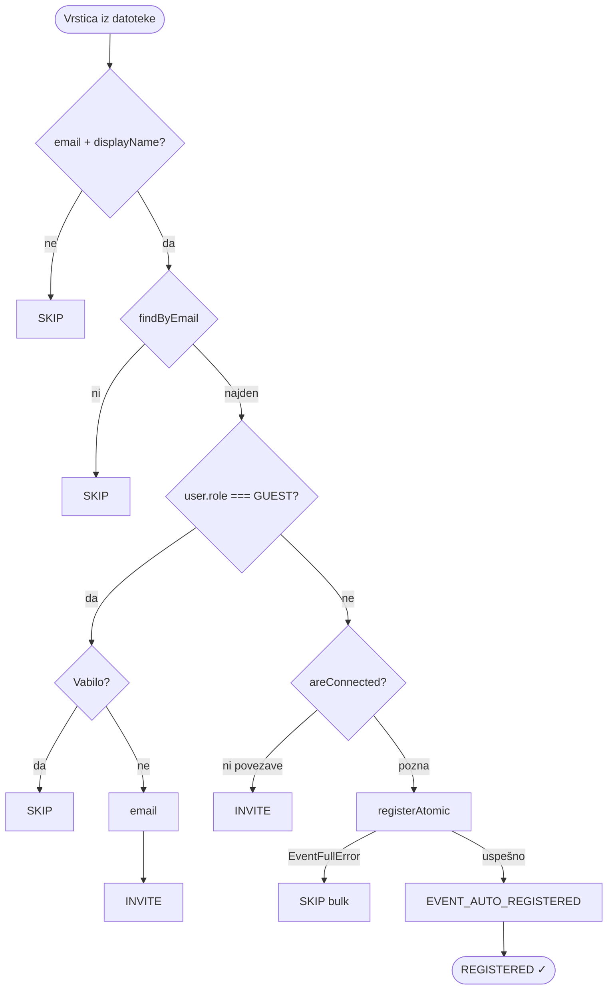

# Export / Import — registracije na dogodku

Organizatorji in admini lahko izvozijo seznam registriranih udeležencev ter uvozijo nov seznam iz CSV ali Excel datoteke. Uvoz ni samo registracija — sistem pametno razlikuje med vlogami in obstoječimi povezavami ter se ustrezno odzove na vsak primer.

---

## Export registracij

`GET /events/:id/registrations/export?format=csv|excel`

Backend pridobi UIDs iz kolekcije `events/{eventId}/registrations`, za vsak UID poišče uporabniški zapis in sestavi vrstice `{ displayName, email }`. Rezultat se pretvori v CSV ali Excel buffer in vrne kot `attachment` — brez shranjevanja na disk, vse v pomnilniku.

**Zakaj memory buffer?** Ni potrebe po začasnih datotekah ali zunanjih shrambah. Buffer se ustvari, vrne in zavrže — preprosteje in brez čiščenja.

---

## Import registracij

`POST /events/:id/registrations/import` (`multipart/form-data`, polje `file`)

Datoteka se sprejme v pomnilnik (Multer `memoryStorage`, max 1 MB), razčleni in vsaka vrstica se obdela glede na stanje uporabnika. Vsak rezultat se šteje v tri kategorije: `registeredCount`, `invitedCount`, `skippedCount`.

### Logika odločanja po vrstici

**Zakaj atomična registracija?** `registerAtomic` prepreči prekoračitev kapacitete v primeru sočasnih uvozov. Ob `EventFullError` se obdelava zaključi takoj in preostale vrstice se skupaj štejejo kot preskočene.

**Zakaj razlikujemo gosta od navadnega uporabnika?** Gost ne sme biti direktno registriran — sistem mu pošlje posebno povabilo s potrditvenim žetonom (`confirmationToken`). Navadni uporabnik, ki ga organizator pozna, pa je registriran takoj brez dodatnega koraka.

---

## Parsanje in validacija datotek

Obe obliki (CSV, Excel) vrneta enako strukturo: `Record<string, unknown>[]` z imeni stolpcev kot ključi.

**CSV** (`csv-parse`): nastavljeno z `columns: true`, `trim: true`, `bom: true`. BOM podpora je nujna za datoteke izvožene iz Excela — brez tega se prvi stolpec pogosto ne prepozna pravilno.

**Excel** (`exceljs`): prva vrstica so glave, vsaka celica se normalizira v niz. Posebej se obravnavajo: `RichText` (spoji segmente), formule (vzame `result`), datumi (ISO string). Brez tega normaliziranja bi exceljs vrnil objekte namesto nizov in parsanje bi tihо pokvarilo podatke.

**Varnostna validacija datoteke** poteka pred parsanjem — preverita se MIME type in končnica. Dovoljena sta samo `text/csv` in `.xlsx` / `.xls`. Napačen tip vrne `400` takoj, brez branja vsebine.

---

## Sanitizacija profilnih polj (`sanitizeImportRow`)

Pri uvozu profilnih podatkov (ločena funkcionalnost — uvoz polj kot `bio`, `tags` itd.) se vsaka vrstica preide skozi `sanitizeImportRow`:

- Samo polja iz `IMPORTABLE_FIELDS` se prenesejo naprej — vsa ostala so tiho zavržena (whitelist pristop)
- Polja nizov so omejena na 500 znakov
- Array polje `tags` je kodirano kot `|`-ločene vrednosti; vsaka vrednost max 100 znakov, skupaj max 20 elementov
- `meetingType` mora biti ena od dovoljenih vrednosti (`online`, `in-person`, `both`)

Polja `interests`, `goals`, `competencies` in `researchKeywords` niso več del
trenutnega profila in naj se ne uporabljajo v novih uvoznih predlogah.

**Zakaj whitelist in ne blacklist?** Whitelist pristop pomeni, da morebitno novo polje v bazi nikoli ne bo nehote prepisano prek uvoza. 

