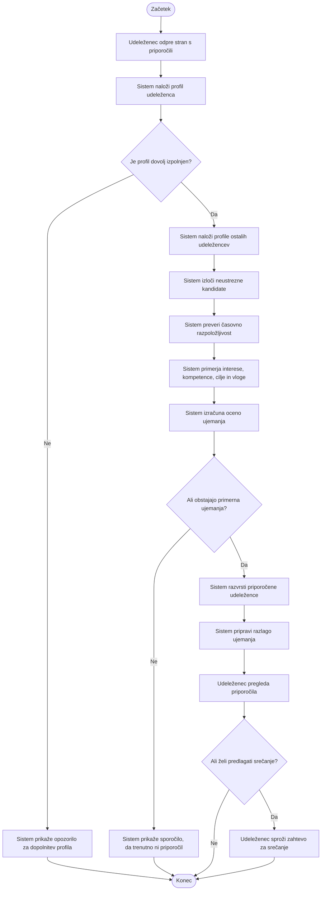
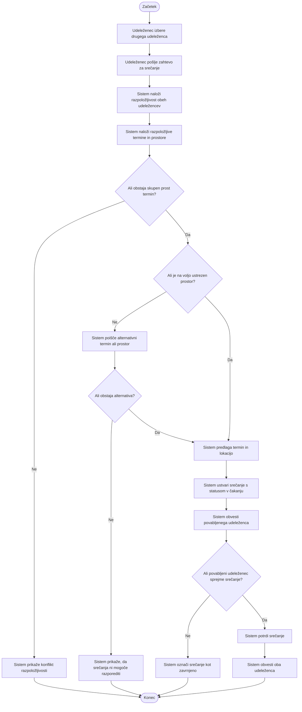
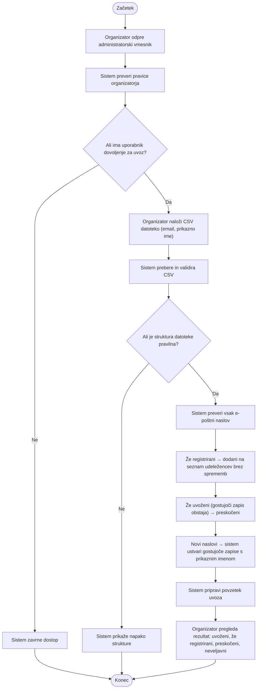
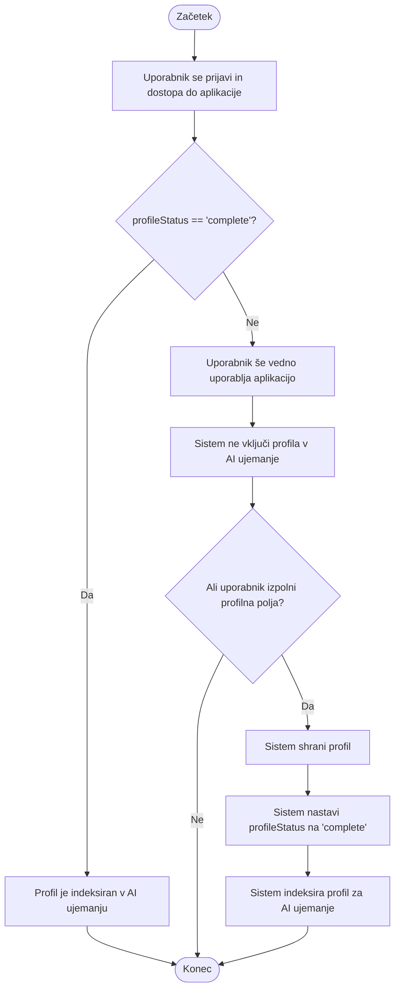
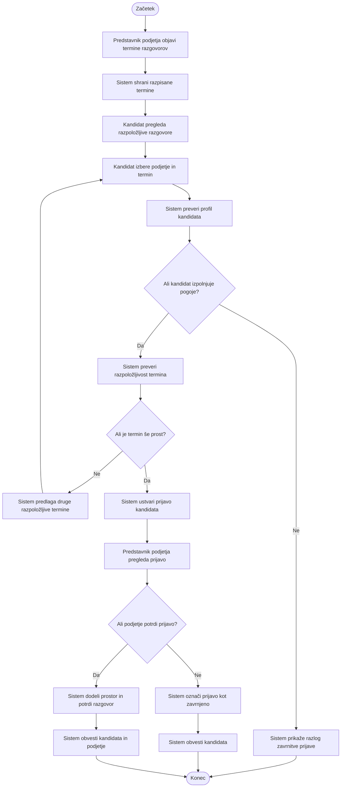

# Aktivnostni Diagrami

Ta dokument vsebuje glavne poslovne tokove sistema Confera. Diagrami so zapisani v Mermaid sintaksi kot `flowchart`, kar omogoča neposreden prikaz v GitHubu in kasnejši izvoz v PDF obliko.

## Proces AI Priporočanja Udeležencev

## Proces Razporejanja Srečanja

## Proces Uvoza Udeležencev Iz CSV

## Proces Dopolnitve Profila

## Proces Prijave Na Karierni Razgovor

